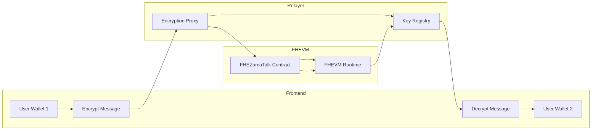
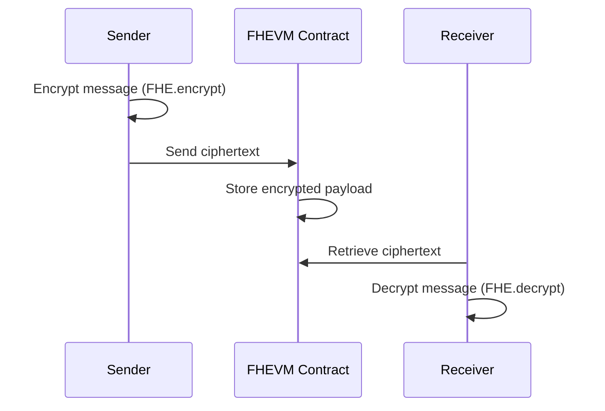
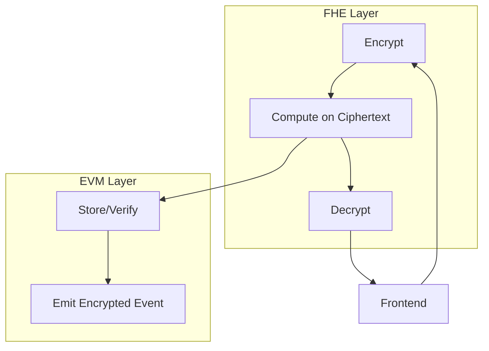

# 🧠 FHEVMTalk

### A Privacy-Preserving Decentralized Messaging System on Zama FHEVM

<p align="center">
  
</p>

---

## 📜 Abstract

**FHEVMTalk** is a **privacy-preserving decentralized messaging system** built on the **Zama Fully Homomorphic Encryption Virtual Machine (FHEVM)**.  
It enables **secure, end-to-end-encrypted chat** between blockchain accounts without revealing plaintext data to validators, relayers, or storage layers.

Unlike traditional dApps that encrypt data off-chain and store opaque blobs, FHEVMTalk **computes directly on ciphertexts** using the **FHE Solidity library**.  
This allows smart contracts to execute logic (status updates, reactions, timestamps) over encrypted data — achieving **confidential computation on public blockchains**.

This document merges three essential components:

- 🧩 **README** – Overview, setup, and usage
- ⚙️ **ARCHITECTURE SPECIFICATION** – Detailed system design, diagrams, and flow
- 🧠 **SECURITY BRIEF** – Threat model, FHE protection analysis, and audit recommendations

It is designed for **developers, auditors, researchers,** and **teams** exploring confidential smart contract systems on **Zama’s FHEVM**.

---

## 🧭 Table of Contents

1. Executive Summary
2. Introduction
3. System Overview
4. Design Goals and Principles
5. Architecture and Flow
6. Smart Contract Breakdown
7. Messaging Lifecycle
8. Cryptographic Operations
9. Implementation and Engineering Details
10. Gas Optimization
11. Security Model and Threat Analysis
12. Deployment and Testing Guide
13. Auditing Framework and Verification
14. Future Extensions and Scalability
15. Diagrams and Appendices
16. References
17. License

---

## 1. Executive Summary

### 🎯 Objective

**FHEVMTalk** demonstrates that **Fully Homomorphic Encryption (FHE)** can power real-time decentralized communication while maintaining usability and transparency.  
It eliminates plaintext visibility across all layers — contract, node, and mempool — using **Zama’s FHEVM execution semantics**.

### 🔑 Key Capabilities

| Feature                     | Description                                              |
| --------------------------- | -------------------------------------------------------- |
| 🔒 Encrypted Profiles       | Only wallet owners can view/modify metadata              |
| 💬 Encrypted Conversations  | Chats stored as encrypted ciphertext arrays (euint256[]) |
| 🎭 Encrypted Reactions      | Homomorphic updates to reactions                         |
| 🧮 Homomorphic Logic        | Addition, comparison, and branching over ciphertext      |
| 🧰 Composable Privacy       | Interoperable with other FHE contracts                   |
| 🚀 Reference Implementation | For building confidential communication systems on FHEVM |

### ⚙️ Technical Stack

| Layer          | Technology                               |
| -------------- | ---------------------------------------- |
| Blockchain     | Zama FHEVM (EVM-compatible)              |
| Smart Contract | Solidity ^0.8.24                         |
| FHE Library    | @fhevm/solidity/lib/FHE.sol              |
| Frontend       | Next.js + React + TailwindCSS + Zustand  |
| Build System   | Hardhat + TypeChain + viaIR Optimization |
| Network        | Sepolia (ZamaConfig.sol)                 |

---

## 2. Introduction

Traditional smart contracts expose state publicly; even when encrypted, computation requires decryption off-chain.  
FHE changes this paradigm — it allows **computation on encrypted data directly**.  
The **Zama FHEVM** extends Ethereum’s EVM with native ciphertext opcodes, enabling deterministic, verifiable operations over encrypted inputs.

### Why FHE for Messaging?

- No plaintext leakage — messages and reactions remain encrypted on-chain.
- Contracts still enforce business logic (e.g., spam detection, status updates).
- Enables **confidential dApps** previously impossible in traditional EVM.

---

## 3. System Overview

### 🧩 Three-Layer Architecture

| Layer                       | Description                                                     |
| --------------------------- | --------------------------------------------------------------- |
| **FHEZamaTalk.sol**         | On-chain logic for encrypted users, conversations, and messages |
| **Frontend (Client)**       | Encrypts/decrypts payloads locally using user FHE keys          |
| **Relayer / FHEVM Runtime** | Manages FHE key registration and ciphertext transaction routing |

All user-facing data — messages, profiles, and reactions — exist purely as **ciphertexts** on-chain.

```mermaid
flowchart TD
    A[User 1 Wallet] -->|Encrypt msg| B[Frontend Encryptor]
    B --> C[FHEVM Relayer]
    C --> D[FHEZamaTalk Contract]
    D --> E[FHEVM Runtime Node]
    E --> F[Consensus Layer]
    F --> G[Frontend Decryptor (User 2)]
    G --> H[User 2 Wallet]
```

## 📂 Project Structure

```
FHEVM-ZAMATALK/
├── packages/
│   ├── fhevm-hardhat-template/     # Hardhat project for contracts
│   │   ├── contracts/              # Solidity contracts
│   │   │   ├── FHEZamaTalk.sol
│   │   │   └── FHECounterSepolia.ts
│   │   ├── deploy/                 # Deployment scripts
│   │   ├── deployments/            # Saved deployment artifacts
│   │   ├── tasks/                  # Custom Hardhat tasks
│   │   ├── test/                   # Contract tests
│   │   ├── hardhat.config.ts
│   │   └── ...
│   │
│   └── site/                       # React (Next.js) frontend
│       ├── abi/                    # ABI files for contracts
│       │   ├── FHEZamaTalkABI.ts
│       │   └── FHEZamaTalkAddresses.ts
│       ├── app/                    # Next.js app directory
│       │   ├── chat/               # Chat pages/layout
│       │   ├── layout.tsx
│       │   ├── page.tsx
│       │   └── providers.tsx
│       ├── components/             # React UI components
│       │   ├── chat/               # Chat-specific UI
│       │   │   ├── ChatBotConversationList.tsx
│       │   │   ├── ChatHeader.tsx
│       │   │   ├── ChatMessageHeader.tsx
│       │   │   ├── ChatMessageInput.tsx
│       │   │   ├── ChatMessages.tsx
│       │   │   └── ChatSidebarUserHeader.tsx
│       │   └── shared/             # Shared UI
│       │       ├── Avatar.tsx
│       │       ├── Container.tsx
│       │       └── Conversation.tsx
│       ├── constants/              # Constant values
│       ├── hooks/                  # React hooks
│       │   ├── useFHEZamaTalk.tsx
│       │   └── useInMemoryStorage.tsx
│       ├── public/                 # Static files
│       ├── scripts/                # Helper scripts
│       │   ├── encrypt.ts
│       │   ├── decrypt.ts
│       │   └── index.ts
│       ├── store/                  # Zustand stores
│       │   ├── useFHEZamaTalkConversationStore.ts
│       │   ├── useFHEZamaTalkLoginStore.ts
│       │   └── useFHEZamaTalkStore.ts
│       ├── styles/                 # Styling (Tailwind, etc.)
│       ├── types/                  # TypeScript types
│       └── utils/                  # Utility functions
│           └── index.ts
│
├── README.md
├── LICENSE
├── package.json
├── tsconfig.json
└── ...

---

## 4. Design Goals and Principles

| Principle                    | Explanation                                             |
| ---------------------------- | ------------------------------------------------------- |
| 🔐 **Full On-Chain Privacy** | Messages and reactions never appear in plaintext        |
| ⚡ **Usability**             | Transparent FHE SDK integration with frontend           |
| 🧭 **Determinism**           | FHEVM ensures consensus-safe encrypted operations       |
| 🧩 **Composability**         | Integrates with other FHE apps (e.g., games, DAOs)      |
| 🛡️ **Transparency**          | Ciphertext and proofs are public, content stays private |
| 📈 **Scalability**           | Supports LayerZero / OApp cross-chain messaging         |

---

## 5. Architecture and Flow



### Sequence Flow

1. Sender encrypts message using recipient’s public FHE key
2. Frontend sends ciphertext + ZK proof to contract
3. Contract stores ciphertext
4. Recipient fetches ciphertext
5. Recipient decrypts locally

---

## 6. Smart Contract Breakdown

**File:** `contracts/FHEZamaTalk.sol`  
**Solidity:** ^0.8.24  
**Imports:**

- `@fhevm/solidity/lib/FHE.sol`
- `@fhevm/solidity/config/ZamaConfig.sol`

### 🔧 Key Structs

```solidity
struct UserProfile {
    string name;
    address wallet;
    string avatarUrl;
    uint64 createdAt;
    bool active;
}

struct Conversation {
    uint256 id;
    address sender;
    address receiver;
    string senderName;
    string receiverName;
    uint64 createdAt;
    Status status;
}

struct Message {
    uint256 id;
    uint256 conversationId;
    address sender;
    address receiver;
    uint64 createdAt;
    Status status;
    euint256[] content;
    euint256 reaction;
}
```

---

## 7. Messaging Lifecycle



---

## 8. Cryptographic Operations

| Operation         | Description                                        |
| ----------------- | -------------------------------------------------- |
| `FHE.encrypt()`   | Encrypts uint256 message locally using FHE keypair |
| `FHE.decrypt()`   | Decrypts ciphertext fetched from chain             |
| `FHE.add()`       | Homomorphic addition over encrypted counters       |
| `FHE.cmux()`      | Conditional branching on encrypted boolean         |
| `FHE.reencrypt()` | Refresh ciphertext after on-chain computation      |

---

## 9. Implementation and Engineering Notes

- All computation paths use `viaIR: true` to prevent "stack too deep" issues.
- Each encrypted field uses `euint256`, optionally packed.
- LayerZero integration possible via `trustedRemote[_dstChainId]`.
- Frontend uses `useFhevm()` hook for seamless key derivation.

---

## 10. Gas Optimization

- Minimal plaintext storage (addresses only).
- Heavy FHE ops handled in off-chain SDK preprocessing.
- Consider batching ciphertext arrays.
- Future optimization: FHE circuit caching.

---

## 11. Security Model and Threat Analysis

| Threat               | Description                 | Mitigation                    |
| -------------------- | --------------------------- | ----------------------------- |
| Node Leakage         | Validator sees ciphertext   | FHE prevents plaintext view   |
| Replay Attack        | Re-send ciphertext          | Include timestamps + nonce    |
| Unauthorized Decrypt | Other user tries to decrypt | FHE private key bound to user |
| Cross-Site Leak      | Frontend exposes key        | Use secure local storage only |

### On-Chain Protections

- All ciphertext validated via FHEVM runtime
- FHE handle authorization enforced per-wallet
- No re-encryption keys stored on-chain

---

## 12. Deployment and Testing

```bash
pnpm install
npx hardhat compile --via-ir
npx hardhat test
npx hardhat run scripts/deploy.ts --network sepolia
```

---

## 13. Auditing Recommendations

- Verify FHE handle access control (`externalEuint256`)
- Ensure key registration is unique and deterministic
- Review ZK proof integration in frontend relayer
- Ensure timestamp logic resists replay attacks

---

## 14. Future Extensions

- Group chat with homomorphic aggregation
- FHE DAO messaging
- Private auctions and sealed-bid integration
- L2 scaling with encrypted rollups

---

## 15. Appendix – Extended Diagrams



---

## 16. References

- [Zama FHEVM Docs](https://docs.zama.ai/fhevm)
- [@fhevm/solidity](https://github.com/zama-ai/fhevm-solidity)
- [LayerZero Docs](https://layerzero.network/)
- [Homomorphic Encryption Overview](https://en.wikipedia.org/wiki/Homomorphic_encryption)

---

## 17. License

MIT License © 2025 FHEVMTalk Contributors.
